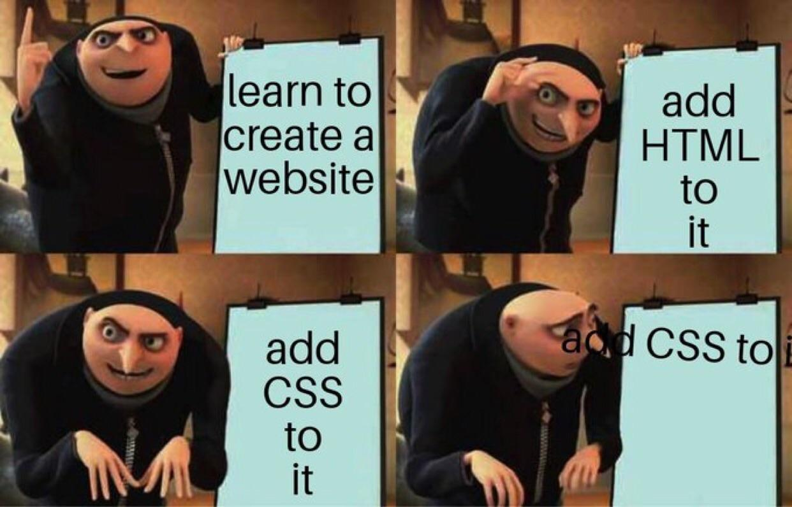
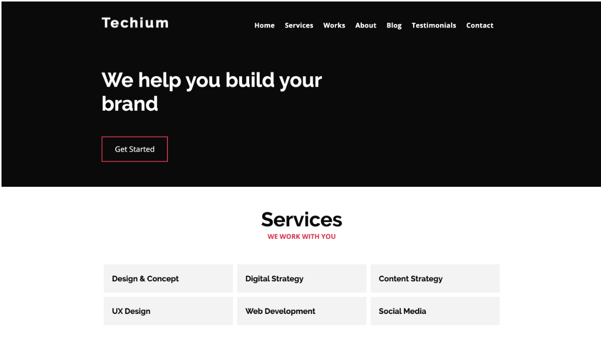
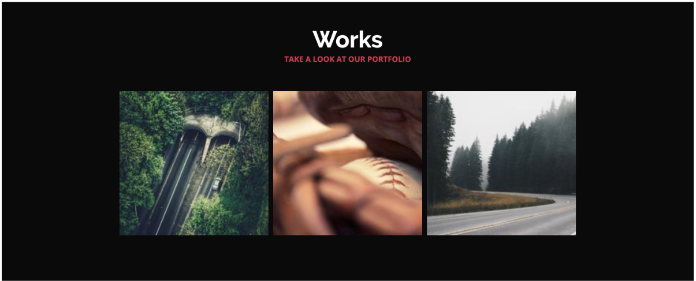
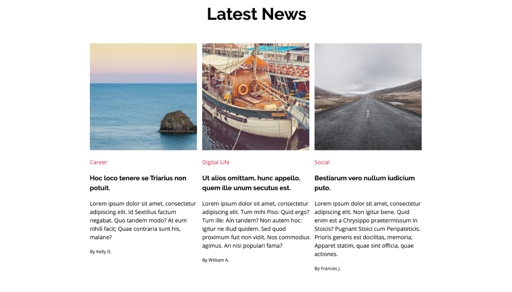
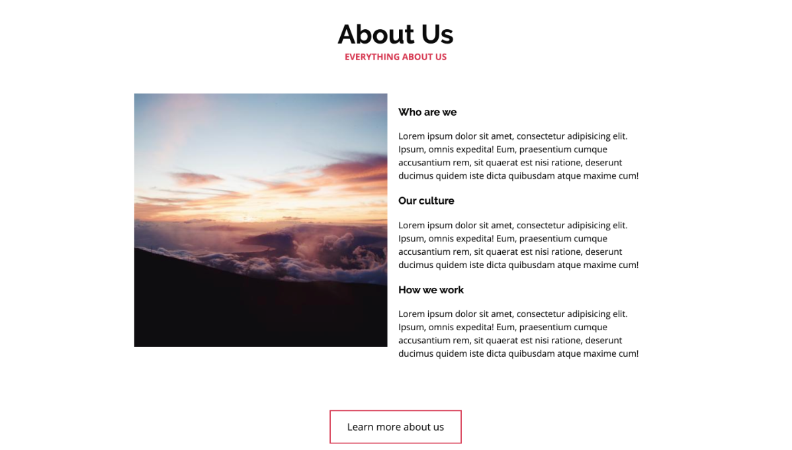
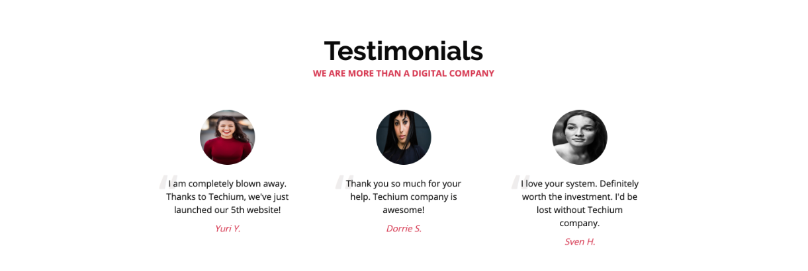
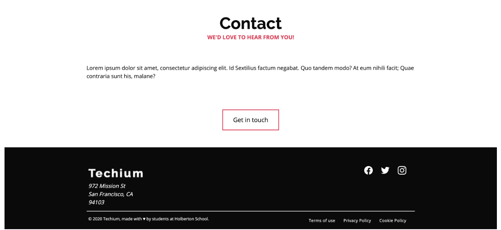

<p align="center">
  
</p>

# CSS Advanced

> Making the Techium website look as good as it works — one selector at a time.

---

## 📝 Description

This project picks up exactly where `html_advanced` left off. With the HTML structure already in place, I now style the Techium website using CSS, progressively building from the most fundamental rules up to advanced techniques including CSS custom properties (variables), grid layout with floats, pseudo-classes and pseudo-elements, background gradients, CSS animations, 2D/3D transforms, and smooth transitions. By the end of the project, the Techium website has a polished, professional look that is consistent across browsers.

---

## 🎯 Learning Objectives

By the end of this project, I am able to explain what CSS selectors, properties, and values are and how they interact. I understand the difference between block and inline styling and know how to use a CSS reset (normalize.css) to ensure consistent rendering across browsers. I know how to define and use CSS custom properties (variables) for colors, fonts, spacing, and more. I understand the differences between inline, embedded, and external CSS and can implement a grid layout system using floats. I know the difference between icon webfonts and SVG icons, between pseudo-classes and pseudo-elements, and how to use both effectively. I am able to create background gradients, animate elements with CSS transitions and `@keyframes`, apply 2D and 3D CSS transforms, and use vendor prefixes where needed.

---

## 🛠️ Technologies Used

This project uses pure CSS3, interpreted in Chrome (version 78.x). The stylesheet is built progressively, with each task building on the previous style file. Google Fonts (Open Sans and Raleway) are integrated via `font-family` variables. Normalize.css (necolas version) is used as a browser reset baseline.

---

## ⚙️ Requirements

- Browser: Chrome (version 78.x)
- Editors: `vi`, `vim`, `emacs`, `VSCode`, `Atom`
- All files must end with a new line
- All files must start with a comment describing the task
- A README.md file at the root of the project folder is mandatory
- Code should be W3C compliant and validated with W3C Validator (where specified)
- Images folder must include at least 10 images representing the project categories

---

## 🚀 Installation

```bash
git clone https://github.com/GwenP88/holbertonschool-web_front_end.git
cd holbertonschool-web_front_end/CSS_advanced
```

Link the desired CSS file in the `index.html` by updating the `<link rel='stylesheet' href='#'>` to point to the correct file (e.g., `styles/32-style.css` for the final version).

---

## ▶️ Usage / Execution

Open `index.html` in Chrome with the relevant stylesheet linked:

```html
<link rel="stylesheet" href="styles/32-style.css">
```

Then open the file in the browser:
```bash
xdg-open index.html
```

---

## 📊 Project Progress

<p align="center">

</p>

<p align="center">
<sub>Mandatory tasks completion: 100%</sub>
</p>

---

## ✨ Features

### Task 0 - Let's get some images!

- **Status:** Mandatory
- **Objective:** Download 10 high-resolution images from Unsplash to use across the project, including work, blog, people, and about categories, plus logos and favicon.
- **Constraint:** Images must match the category they represent. Same images will be reused in the Responsive Design project.
- **Expected behavior:** Images are available in the `images/` directory with the correct filenames.

**Files:** `images/pic-about-01.jpg`, `images/pic-work-01.jpg`, `images/pic-work-02.jpg`, `images/pic-work-03.jpg`, `images/pic-article-01.jpg`, `images/pic-article-02.jpg`, `images/pic-article-03.jpg`, `images/pic-person-01.jpg`, `images/pic-person-02.jpg`, `images/pic-person-03.jpg`

---

### Task 1 - Effortless transitions when scrolling

- **Status:** Mandatory
- **Objective:** Set `scroll-behavior: smooth` on the `html` element for fluid scroll transitions.
- **Constraint:** Applied to the `html` selector.
- **Expected behavior:** Scrolling the page feels fluid rather than jumping.

**Files:** `styles/1-style.css`

---

### Task 2 - Do you know your color values?

- **Status:** Mandatory
- **Objective:** Set foreground colors for `body`, anchor elements, `.visually-hidden` (display none), `.card-category`, and `.section-tagline`.
- **Constraint:** Use explicit hex/color values. Body and anchors: `#161616`. Category and tagline: `#D73953`.
- **Expected behavior:** Text colors are applied consistently across base elements.

**Files:** `styles/2-style.css`

---

### Task 3 - Reuse and repeat. A programmer's life should be simple with variables

- **Status:** Mandatory
- **Objective:** Define CSS custom properties on `:root` for the core color palette and replace hard-coded color values with variable references.
- **Constraint:** Variables: `color-primary`, `color-black`, `color-white`, `color-light-grey`, `color-dark-grey`, `text-color`. W3C validation not required.
- **Expected behavior:** All colors reference CSS variables, making the palette easy to update globally.

**Files:** `styles/3-style.css`

---

### Task 4 - Variables for storing certain font types

- **Status:** Mandatory
- **Objective:** Define `font-family-base` and `font-family-title` custom properties and apply them to `body` and headings.
- **Constraint:** Both use the same fallback stack: `Helvetica Neue`, `Helvetica`, `Arial`, `sans-serif`. W3C validation not required.
- **Expected behavior:** Body text and headings use the defined font family variables.

**Files:** `styles/4-style.css`

---

### Task 5 - Variables for the font size

- **Status:** Mandatory
- **Objective:** Define font size variables on `:root` (`font-size-small` through `font-size-xx-large`) and set `html` to `62.5%` base size, `body` to `font-size-medium`.
- **Constraint:** 62.5% on `html` enables a 10px rem base for easy calculation. W3C validation not required.
- **Expected behavior:** Font sizes across the page are controlled via variables, with a clean rem-based scale.

**Files:** `styles/5-style.css`

---

### Task 6 - Variables for the font-weight

- **Status:** Mandatory
- **Objective:** Define `font-weight-regular` (400) and `font-weight-bold` (700) on `:root` and apply them to `body` and headings respectively.
- **Constraint:** W3C validation not required.
- **Expected behavior:** Body text is regular weight; headings are bold.

**Files:** `styles/6-style.css`

---

### Task 7 - Integrating Google Fonts into the CSS file

- **Status:** Mandatory
- **Objective:** Add `Open Sans` as the first choice for `font-family-base` and `Raleway` as the first choice for `font-family-title`.
- **Constraint:** Previous fonts remain in the stack, shifted down. W3C validation not required.
- **Expected behavior:** Google Fonts are used for base and title text, with local fonts as fallbacks.

**Files:** `styles/7-style.css`

---

### Task 8 - Defining line heights

- **Status:** Mandatory
- **Objective:** Define `line-height-small` (1.2), `line-height-base` (1.5), and `line-height-big` (1.8) on `:root` and apply `line-height-base` to `body`.
- **Constraint:** W3C validation not required.
- **Expected behavior:** Body text has comfortable line spacing using the base variable.

**Files:** `styles/8-style.css`

---

### Task 9 - Links are decorated by default, time to remove them

- **Status:** Mandatory
- **Objective:** Remove text decoration from all anchor elements.
- **Constraint:** Apply `text-decoration: none` to `a` tags. W3C validation not required.
- **Expected behavior:** Links no longer display the default underline.

**Files:** `styles/9-style.css`

---

### Task 10 - Centering the section titles

- **Status:** Mandatory
- **Objective:** Define `section-header-align: center` and apply it to `.section-header`.
- **Constraint:** W3C validation not required.
- **Expected behavior:** Section headers are horizontally centered.

**Files:** `styles/10-style.css`

---

### Task 11 - Add more styles to the section tagline

- **Status:** Mandatory
- **Objective:** Style `.section-tagline` with `font-family-title`, uppercase transform via variable, and `font-weight-bold`.
- **Constraint:** Use `section-tagline-transform` variable set to `uppercase`. W3C validation not required.
- **Expected behavior:** Section taglines appear bold, uppercase, and in the title font.

**Files:** `styles/11-style.css`

---

### Task 12 - Adding more styling to the section title

- **Status:** Mandatory
- **Objective:** Style `.section-title` with title font, extra-large size, bold weight, zero margin, and black color — all via variables.
- **Constraint:** Variables: `section-title-margin: 0`, `section-title-color: color-black`. W3C not required.
- **Expected behavior:** Section titles are large, bold, and styled with the title font.

**Files:** `styles/12-style.css`

---

### Task 13 - Pseudo Classes

- **Status:** Mandatory
- **Objective:** Add pseudo-class rules for anchor links: style `a:link`, `a:visited` (italic), `a:hover` (underline), and `a:active` (light grey background).
- **Constraint:** W3C validation not required.
- **Expected behavior:** Links change appearance based on interaction state.

**Files:** `styles/13-style.css`

---

### Task 14 - Resetting the CSS stylesheet for browser consistency

- **Status:** Mandatory
- **Objective:** Prepend necolas' normalize.css to the stylesheet for cross-browser consistency.
- **Constraint:** W3C validation not required.
- **Expected behavior:** Default browser styling differences are neutralized before custom styles are applied.

**Files:** `styles/14-style.css`

---

### Task 15 - Add universal box-sizing

- **Status:** Mandatory
- **Objective:** Add a universal `box-sizing: border-box` rule before the `html` styles.
- **Constraint:** W3C validation not required.
- **Expected behavior:** All elements use border-box sizing, making layout calculations more predictable.

**Files:** `styles/15-style.css`

---

### Task 16 - Styling the container

- **Status:** Mandatory
- **Objective:** Set `.container` to `960px` wide with auto left/right margins (centering it).
- **Constraint:** W3C validation not required.
- **Expected behavior:** All content is contained within a centered 960px column.

**Files:** `styles/16-style.css`

---

### Task 17 - Adding padding to sections

- **Status:** Mandatory
- **Objective:** Define padding variables for sections, section headers, bodies, and footers, and apply them along with footer padding.
- **Constraint:** Multiple variables defined on `:root`. W3C validation not required.
- **Expected behavior:** Sections have consistent vertical padding creating breathing room between content areas.

**Files:** `styles/17-style.css`

---

### Task 18 - Customizing the navbar

- **Status:** Mandatory
- **Objective:** Style the navbar with float, font variables, letter spacing, inline-block display, link hover color, and a `::before` pseudo-element underline animation setup.
- **Constraint:** Multiple custom properties for nav items. W3C validation not required.
- **Expected behavior:** Navigation items are inline, properly spaced, and styled with the title font.

**Files:** `styles/18-style.css`

---

### Task 19 - Grid styling and custom variables

- **Status:** Mandatory
- **Objective:** Style the grid system using `.row`, `.col-1-3`, `.col-1-2`, and `.footer-copyright` classes with appropriate widths, floats, and padding.
- **Constraint:** Footer text right-aligned. Footer-copyright in small font. W3C validation not required.
- **Expected behavior:** A two and three column grid layout is functional using float-based columns.

**Files:** `styles/19-style.css`

---

### Task 20 - Clear the context of the grid

- **Status:** Mandatory
- **Objective:** Add a clearfix rule using `::after` pseudo-element on `.row` to prevent float collapse.
- **Constraint:** `content: ""`, `display: table`, `clear: both`. W3C validation not required.
- **Expected behavior:** Rows correctly contain their floated children without collapsing.

**Files:** `styles/20-style.css`

---

### Task 21 - Simplify the col- selector

- **Status:** Mandatory
- **Objective:** Use an attribute selector `[class^="col-"]` to apply shared float and padding rules, removing duplication from individual col classes.
- **Constraint:** Must not break specificity. W3C validation not required.
- **Expected behavior:** All column classes share common float and padding rules via a single selector.

**Files:** `styles/21-style.css`

---

### Task 22 - Add a dark theme to sections

- **Status:** Mandatory
- **Objective:** Style `[data-section-theme="dark"]` to override `text-color` and `section-title-color` to white and set background to `color-black`.
- **Constraint:** W3C validation not required.
- **Expected behavior:** Sections with the dark theme attribute display white text on a black background.

**Files:** `styles/22-style.css`

---

### Task 23 - Fix issues for dark theme

- **Status:** Mandatory
- **Objective:** Style `.footer-address`, `.social-link` (block display), and `.social-link svg` (fill with `text-color`) to work correctly in dark context.
- **Constraint:** W3C validation not required.
- **Expected behavior:** Footer address and social SVG icons display correctly in both light and dark themes.

**Files:** `styles/23-style.css`

---

### Task 24 - Add background and hover state to services

- **Status:** Mandatory
- **Objective:** Style `.card-services` cards with light grey background links, and on hover: white text, primary color background, no decoration.
- **Constraint:** W3C validation not required.
- **Expected behavior:** Service cards have a grey background that changes to the primary color on hover.

**Files:** `styles/24-style.css`

---

### Task 25 - Add border to the button

- **Status:** Mandatory
- **Objective:** Define button custom properties and create `.button` class styles with border, padding, font size, and hover state. Add dark theme override for button color.
- **Constraint:** Multiple button variables defined on `:root`. W3C validation not required.
- **Expected behavior:** Buttons have a visible border, correct sizing, and an inverted color scheme on hover.

**Files:** `styles/25-style.css`

---

### Task 26 - Add border radius to images

- **Status:** Mandatory
- **Objective:** Style `.card-testimonial` for centered layout, make `.card-avatar` circular (50% border-radius, 100px square), and style `<cite>` inside `.card-quote`.
- **Constraint:** W3C validation not required.
- **Expected behavior:** Testimonial avatars appear as circular images with a colored author citation below.

**Files:** `styles/26-style.css`

---

### Task 27 - Styling the section hero

- **Status:** Mandatory
- **Objective:** Style `.section-hero` with background size, bottom margin on the section title, and custom padding on `.section-inner`.
- **Constraint:** Background size: `90rem auto`. Padding: `10rem 40rem 2rem 0`. W3C validation not required.
- **Expected behavior:** Hero section displays with a large background image and proper content padding.

**Files:** `styles/27-style.css`

---

### Task 28 - Fixing the header and menu navigation bar

- **Status:** Mandatory
- **Objective:** Define header positioning variables and style `.header`, `.header-logo`, and its inner link using custom properties for padding, position, and offsets.
- **Constraint:** Multiple header variables defined on `:root`. W3C validation not required.
- **Expected behavior:** The header and logo are correctly positioned relative to the page layout.

**Files:** `styles/28-style.css`

---

### Task 29 - Styling and custom properties for the nav

- **Status:** Mandatory
- **Objective:** Update `nav-item-link-hover` to white and add `::before` pseudo-element underline animations on `.nav .nav-link` and on `.nav-item:hover`.
- **Constraint:** Underline animates width from 0 to 100% on hover. W3C validation not required.
- **Expected behavior:** Navigation links display an animated underline effect on hover using pure CSS.

**Files:** `styles/29-style.css`

---

### Task 30 - Fix the works section

- **Status:** Mandatory
- **Objective:** Style `.card-work` with overflow hidden, image scaling to fill the card, an absolutely positioned overlay (`card-inner`) that appears on hover, and an opacity animation on the card title.
- **Constraint:** Card title link padding: 45% top. Overlay background: `rgba(0,0,0,0.7)`. W3C validation not required.
- **Expected behavior:** Work cards show an overlay with the project title when hovered, with a smooth visual transition.

**Files:** `styles/30-style.css`

---

### Task 31 - Add quotes decoration on testimonials

- **Status:** Mandatory
- **Objective:** Add a decorative quotation mark (`\201C`) as a `::before` pseudo-element on `.card-testimonial .card-quote`.
- **Constraint:** Absolutely positioned, font size `10rem`, color `#efeded`, `z-index: -1`. W3C validation not required.
- **Expected behavior:** Large decorative open-quote character appears behind each testimonial card.

**Files:** `styles/31-style.css`

---

### Task 32 - Incorporating transitions

- **Status:** Mandatory
- **Objective:** Define `transition-duration` and `transition-cubic-bezier` variables and apply smooth transitions to nav underlines, button hover states, and card work hover animations (image scale and card shrink).
- **Constraint:** Card image scales to 1.2 on hover; card outer shrinks to 0.95. Transitions use the cubic-bezier variable. W3C validation not required.
- **Expected behavior:** All interactive elements (nav links, buttons, work cards) animate smoothly on hover using CSS transitions.

**Files:** `styles/32-style.css`

---

<table align="center">
  <tr>
    <td align="center">
      
    </td>
    <td align="center">
      
    </td>
  </tr>
  <tr>
    <td align="center">
      
    </td>
    <td align="center">
      
    </td>
  </tr>
  <tr>
    <td align="center">
      
    </td>
    <td align="center">
      
    </td>
  </tr>
</table>

## 🤝 Contributions & Acknowledgements

Thanks to the Holberton School team for a CSS project that covers the full spectrum — from color variables to cubic-bezier transitions. Special thanks to the CSS specification authors for giving us pseudo-elements, custom properties, and `transform`, which together make it possible to build something genuinely beautiful with nothing but a stylesheet.

---

## 👤 Author

**Gwenaelle PICHOT**
- Student at Holberton School
- Track: holbertonschool-web_front_end
- Project: CSS_advanced