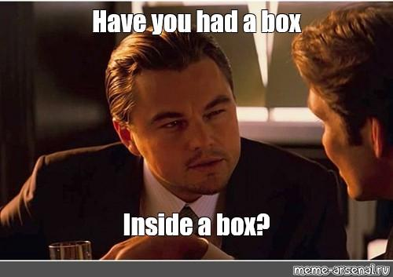
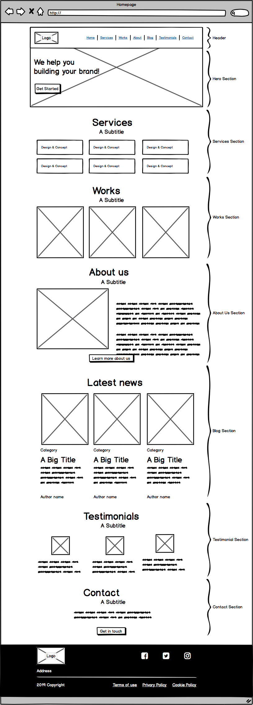

<p align="center">
  
</p>

# HTML Advanced

> Building the skeleton of a website — because even the most beautiful house needs solid bones.

---

## 📝 Description

This project is a deep dive into semantic HTML5. I build a complete, well-structured webpage for a fictional digital agency called **Techium**, starting from a blank HTML file and progressively adding structure, content, navigation, images, media, and accessibility-minded markup. The focus is entirely on correct HTML — no CSS styling involved yet. Every element used has a semantic purpose, and by the end I have a fully structured, content-rich HTML document that is ready to be styled in a future project.

---

## 🎯 Learning Objectives

By the end of this project, I am able to explain which guidelines to follow when writing clean, valid HTML. I know how to create the full skeleton of an HTML5 page, including the doctype, `html`, `head`, and `body` tags with the correct attributes. I understand how to use semantic HTML tags to structure a page — including `header`, `main`, `footer`, `article`, `nav`, `section`, and `aside` — and when to use `div` versus `span` for non-semantic grouping. I know how to use headings correctly and why the hierarchical order (h1 → h2 → h3) matters for accessibility and SEO. I can create ordered, unordered, and definition lists, and I understand the differences between image formats (SVG, GIF, PNG, JPG). I am able to structure data in tables, embed video and audio players, include iframes for external content, and build a properly structured, W3C-valid HTML document from scratch.

---

## 🛠️ Technologies Used

This project uses pure HTML5. No CSS, no JavaScript. Validation is performed using the W3C Validator. The company name used throughout the project is Techium.

---

## ⚙️ Requirements

- A README.md file at the root of the project folder is mandatory
- Code should be W3C compliant and validated with the W3C Validator (where specified)
- The company name used across all pages is `Techium`
- Editors: `vi`, `vim`, `emacs`, or any other

---

## 🚀 Installation

```bash
git clone https://github.com/GwenP88/holbertonschool-web_front_end.git
cd holbertonschool-web_front_end/html_advanced
```

---

## ▶️ Usage / Execution

Open any `.html` file directly in a browser:

```bash
xdg-open 0-index.html
# or simply double-click the file in your file manager
```

---

## 📊 Project Progress

<p align="center">

</p>

<p align="center">
<sub>Mandatory tasks completion: 100%</sub>
</p>

---

<p align="center">
  
</p>

## ✨ Features

### Task 0 - Create your first webpage

- **Status:** Mandatory
- **Objective:** Create the first HTML file with a doctype, an `<html>` tag specifying language (`en`) and direction (`ltr`).
- **Constraint:** Doctype on the first line with no comment. W3C validation not required.
- **Expected behavior:** A valid (if minimal) HTML document that opens as a blank page in the browser.

**Files:** `0-index.html`

---

### Task 1 - Structure your webpage

- **Status:** Mandatory
- **Objective:** Add `<head>` and `<body>` tags inside the `<html>` tag.
- **Constraint:** Tags must be in the correct order: head before body.
- **Expected behavior:** Page still renders as blank but now has the correct structural skeleton.

**Files:** `1-index.html`

---

### Task 2 - The head - meta charset, viewport, title, description, favicons

- **Status:** Mandatory
- **Objective:** Populate the `<head>` with charset meta, viewport meta, title, description, and two favicon link tags.
- **Constraint:** Title must be `Homepage - Techium`. Description: `Techium is a digital agency`. Viewport must include `width=device-width`, `initial-scale=1.0`, and `viewport-fit=cover`.
- **Expected behavior:** The browser tab shows `Homepage - Techium` and favicons appear in the tab.

**Files:** `2-index.html`

---

### Task 3 - Simple header, main, footer

- **Status:** Mandatory
- **Objective:** Add semantic `<header>`, `<main>`, and `<footer>` tags with placeholder text inside the `<body>`.
- **Constraint:** Elements must be in the correct order.
- **Expected behavior:** The page displays three text sections: Header, Main content, Footer.

**Files:** `3-index.html`

---

### Task 4 - Aside

- **Status:** Mandatory
- **Objective:** Create `article.html` with a title of `Article - Techium` and add an `<aside>` tag inside `<main>`.
- **Constraint:** Based on `3-index.html`. Title must be updated.
- **Expected behavior:** Page shows main content and an aside section.

**Files:** `article.html`

---

### Task 5 - Section

- **Status:** Mandatory
- **Objective:** Replace the `<main>` text content with 7 named `<section>` tags: Hero, Services, Works, About, Latest news, Testimonials, Contact.
- **Constraint:** Based on `3-index.html`. W3C validation not required.
- **Expected behavior:** The main area contains 7 labelled sections.

**Files:** `5-index.html`

---

### Task 6 - Work, News, Testimonial articles

- **Status:** Mandatory
- **Objective:** Add 3 `<article>` elements inside each of the Works, Latest news, and Testimonials sections.
- **Constraint:** Each article contains numbered placeholder text. W3C validation not required.
- **Expected behavior:** Three grouped articles visible inside each of the three target sections.

**Files:** `6-index.html`

---

### Task 7 - Navigation

- **Status:** Mandatory
- **Objective:** Remove the header text and add an empty `<nav>` tag inside the `<header>`.
- **Constraint:** Nav should remain empty for now. W3C validation not required.
- **Expected behavior:** Header area contains an empty navigation element.

**Files:** `7-index.html`

---

### Task 8 - Level 1 headings

- **Status:** Mandatory
- **Objective:** Add an `<h1>` with the text `Homepage` inside `<main>`, before the sections.
- **Constraint:** W3C validation not required.
- **Expected behavior:** The main area starts with an `<h1>` heading.

**Files:** `8-index.html`

---

### Task 9 - Level 2 headings

- **Status:** Mandatory
- **Objective:** Replace the placeholder text in each section with an `<h2>` heading matching the section name (e.g., `Services`, `Works`, `About Us`, etc.).
- **Constraint:** W3C validation not required.
- **Expected behavior:** Each section has a descriptive `<h2>` heading.

**Files:** `9-index.html`

---

### Task 10 - Level 3 headings

- **Status:** Mandatory
- **Objective:** Add `<h3>` headings inside Services, Works, About Us, and Latest news sections.
- **Constraint:** Services gets 6 `<h3>` entries. Works, About Us, and Latest news each get 3. W3C validation not required.
- **Expected behavior:** Each targeted section has properly labeled `<h3>` sub-headings.

**Files:** `10-index.html`

---

### Task 11 - Styleguide

- **Status:** Mandatory
- **Objective:** Create `11-styleguide.html` with title `Styleguide - Techium` containing a section showcasing all 6 heading levels.
- **Constraint:** Based on `3-index.html`. Must include a section with a `<header>` and headings h1 through h6.
- **Expected behavior:** A styleguide page displaying heading hierarchy from h1 to h6.

**Files:** `11-styleguide.html`

---

### Task 12 - Paragraphs

- **Status:** Mandatory
- **Objective:** Add descriptive `<p>` paragraphs throughout About Us, Latest news, Contact, Services, Works, Testimonials, and Contact sections.
- **Constraint:** Specific Lorem ipsum text provided for each paragraph. W3C validation not required.
- **Expected behavior:** All sections have descriptive paragraph content beneath their headings.

**Files:** `12-index.html`

---

### Task 13 - Styleguide paragraphs

- **Status:** Mandatory
- **Objective:** Add a Paragraph section to the styleguide with a heading, subtitle, and body paragraph.
- **Constraint:** Based on `11-styleguide.html`.
- **Expected behavior:** Styleguide now demonstrates both heading and paragraph typography patterns.

**Files:** `13-styleguide.html`

---

### Task 14 - Span

- **Status:** Mandatory
- **Objective:** Add a `<span>` with the company name `Techium` inside the `<header>`, before the `<nav>`.
- **Constraint:** W3C validation not required.
- **Expected behavior:** The header contains a span with the brand name.

**Files:** `14-index.html`

---

### Task 15 - Div

- **Status:** Mandatory
- **Objective:** Wrap the contents of the `<header>`, each `<section>`, and the `<footer>` with `<div>` containers.
- **Constraint:** W3C validation not required.
- **Expected behavior:** All major sections now have a wrapping `<div>` for layout purposes.

**Files:** `15-index.html`

---

### Task 16 - Structure your sections

- **Status:** Mandatory
- **Objective:** Inside each section's `<div>`, split the content into a semantic `<header>` (containing the h2 and introductory p) and a sibling `<div>` (containing the rest).
- **Constraint:** Applied to Services, Works, About Us, Latest news, Testimonials, and Contact sections. W3C validation not required.
- **Expected behavior:** Each section has an internal header and a content div clearly separating heading from body.

**Files:** `16-index.html`

---

### Task 17 - Comments

- **Status:** Mandatory
- **Objective:** Add HTML comments before major structural elements to make the code easier to scan.
- **Constraint:** Comments added before `<header>`, `<main>`, `<footer>`, and each section. W3C validation not required.
- **Expected behavior:** Source code is annotated with section labels as HTML comments.

**Files:** `17-index.html`

---

### Task 18 - Link your logo

- **Status:** Mandatory
- **Objective:** Wrap the `<span>` in the header with a link pointing to `/`, then wrap the link in a `<div>`.
- **Constraint:** W3C validation not required.
- **Expected behavior:** The logo text is now a clickable link to the homepage root.

**Files:** `18-index.html`

---

### Task 19 - Create new pages

- **Status:** Mandatory
- **Objective:** Create `about.html`, `latest_news.html`, and `contact.html` based on `18-index.html` with updated page titles.
- **Constraint:** Titles must be updated to match each page: `About - Techium`, `Latest news - Techium`, `Contact - Techium`. W3C validation not required.
- **Expected behavior:** Three separate pages with correct titles exist alongside the main index.

**Files:** `about.html`, `latest_news.html`, `contact.html`

---

### Task 20 - Add links

- **Status:** Mandatory
- **Objective:** Populate the `<nav>` with anchor links to Home, Services, Works, About, Latest news, Testimonials, and Contact.
- **Constraint:** W3C validation not required. Links to sections use anchor syntax.
- **Expected behavior:** Navigation bar contains all 7 links.

**Files:** `20-index.html`

---

### Task 21 - Add social media links

- **Status:** Mandatory
- **Objective:** Replace footer text with links to Facebook, Twitter, and Instagram (Holberton School profiles).
- **Constraint:** W3C validation not required.
- **Expected behavior:** Footer contains three social media links.

**Files:** `21-index.html`

---

### Task 22 - "Button" links

- **Status:** Mandatory
- **Objective:** Add call-to-action links in the Hero, About Us, and Contact sections (`Get started`, `Learn more about us`, `Get in touch`).
- **Constraint:** W3C validation not required. Hero links to `#`, others to `about.html` and `contact.html`.
- **Expected behavior:** Three CTA links are placed in their respective sections.

**Files:** `22-index.html`

---

### Task 23 - Services, Works, Latest news links

- **Status:** Mandatory
- **Objective:** Wrap the text in each `<h3>` within Services, Works, and Latest news sections with links pointing to `#`.
- **Constraint:** W3C validation not required.
- **Expected behavior:** All service, work, and news headings are clickable links.

**Files:** `23-index.html`

---

### Task 24 - List the links

- **Status:** Mandatory
- **Objective:** Wrap all navigation links and all footer social links into unordered lists.
- **Constraint:** Each anchor becomes a `<li>` inside a `<ul>`. W3C validation not required.
- **Expected behavior:** Nav and footer links are properly structured as list items.

**Files:** `24-index.html`

---

### Task 25 - Secondary navigation menu

- **Status:** Mandatory
- **Objective:** Add a second `<div>` in the footer containing a list of legal/policy links: Terms of Use, Privacy Policy, Cookie Policy.
- **Constraint:** Links point to `#`.
- **Expected behavior:** Footer now has two divs: one for social links, one for secondary nav.

**Files:** `25-index.html`

---

### Task 26 - Examples of lists for the styleguide

- **Status:** Mandatory
- **Objective:** Add a Lists section to the styleguide demonstrating unordered, ordered, and definition lists with sample content.
- **Constraint:** Based on `13-styleguide.html`.
- **Expected behavior:** Styleguide shows all three list types with proper HTML markup.

**Files:** `26-styleguide.html`

---

### Task 27 - Separate content

- **Status:** Mandatory
- **Objective:** Add a horizontal rule `<hr>` and a copyright paragraph between the two footer divs.
- **Constraint:** Copyright text: `© 2020 Techium, made with ♥ by students at Holberton School.` W3C validation not required.
- **Expected behavior:** Footer shows a divider line and copyright notice between the two navigation groups.

**Files:** `27-index.html`

---

### Task 28 - Horizontal rule example

- **Status:** Mandatory
- **Objective:** Add a Horizontal rule section to the styleguide with an `<hr>` element.
- **Constraint:** Based on `26-styleguide.html`.
- **Expected behavior:** Styleguide demonstrates the `<hr>` element in context.

**Files:** `28-styleguide.html`

---

### Task 29 - Client quotes

- **Status:** Mandatory
- **Objective:** Replace article placeholder text in the Testimonials section with `<blockquote>` elements citing real authors.
- **Constraint:** Three testimonials with specific text and `cite` attributes. W3C validation not required.
- **Expected behavior:** Each testimonial article displays a properly marked-up blockquote with attribution.

**Files:** `29-index.html`

---

### Task 30 - Examples of quotes

- **Status:** Mandatory
- **Objective:** Add a Blockquotes section to the styleguide showing both an inline quote (`<q>`) and a full blockquote.
- **Constraint:** Based on `28-styleguide.html`. Blockquote cites Kanye West.
- **Expected behavior:** Styleguide demonstrates both `<q>` and `<blockquote>` with attribution.

**Files:** `30-styleguide.html`

---

### Task 31 - Address and latest news authors

- **Status:** Mandatory
- **Objective:** Add a postal address in the `<footer>` and author bylines (`<address>` and `<small>` tags) to each Latest news article.
- **Constraint:** Address: `234 Washington Street / Urbana, Illinois`. W3C validation not required.
- **Expected behavior:** Footer shows a mailing address; each news article ends with an author credit.

**Files:** `31-index.html`

---

### Task 32 - Typography section - using the correct tags

- **Status:** Mandatory
- **Objective:** Add a Typography section to the styleguide with address, preformatted code, and highlighted text.
- **Constraint:** Use `<address>`, `<pre>`, and `<mark>` tags appropriately. W3C validation not required.
- **Expected behavior:** Styleguide shows semantic typography tags in context.

**Files:** `32-styleguide.html`

---

### Task 33 - Table

- **Status:** Mandatory
- **Objective:** Add a Table section to the styleguide with a properly marked-up HTML table using `<thead>`, `<tbody>`, `<th scope="col">`, and `<th scope="row">`.
- **Constraint:** Based on `32-styleguide.html`. W3C validation not required.
- **Expected behavior:** Styleguide displays an accessible HTML table with correct scope attributes.

**Files:** `33-styleguide.html`

---

### Task 34 - Details

- **Status:** Mandatory
- **Objective:** Add a Details section to the styleguide showing both a default and an open `<details>` element with `<summary>`.
- **Constraint:** Based on `33-styleguide.html`. Second details element must have the `open` attribute.
- **Expected behavior:** Styleguide demonstrates the collapsible `<details>` HTML element in two states.

**Files:** `34-styleguide.html`

---

### Task 35 - Replace text logo with image logo

- **Status:** Mandatory
- **Objective:** Replace the `<span>` with the Techium logo image in both the header and footer. Image: `logo-black.png`, dimensions: 160×40.
- **Constraint:** Alt text: `Techium logo`. W3C validation not required.
- **Expected behavior:** Header and footer both display the Techium logo image instead of text.

**Files:** `35-index.html`

---

### Task 36 - Add images to your sections

- **Status:** Mandatory
- **Objective:** Add images to the Works (3 images), About Us (1 image), Latest news (3 images), and Testimonials (3 avatar images) sections.
- **Constraint:** Specific image filenames and dimensions specified for each. Alt text required for avatar images. W3C validation not required.
- **Expected behavior:** All four sections display relevant images with correct attributes.

**Files:** `36-index.html`

---

### Task 37 - Social icons

- **Status:** Mandatory
- **Objective:** Replace the Facebook, Twitter, and Instagram text links in the footer with inline SVG icon code, each sized 25×25px.
- **Constraint:** SVG code provided for each platform. W3C validation not required.
- **Expected behavior:** Footer social links display SVG icons instead of plain text.

**Files:** `index.html`

---

### Task 38 - Add a video player in the styleguide

- **Status:** Mandatory
- **Objective:** Add a Video section to the styleguide with a `<video>` element that has controls, loops, a poster thumbnail, and a fallback message.
- **Constraint:** Based on `34-styleguide.html`. W3C validation not required.
- **Expected behavior:** Styleguide contains a working video player with poster image and fallback text for unsupported browsers.

**Files:** `38-styleguide.html`

---

### Task 39 - Add an audio player in the styleguide

- **Status:** Mandatory
- **Objective:** Add an Audio section to the styleguide with an `<audio>` element that has controls and a fallback message.
- **Constraint:** Based on `38-styleguide.html`. W3C validation not required.
- **Expected behavior:** Styleguide contains a working audio player with appropriate fallback text.

**Files:** `39-styleguide.html`

---

### Task 40 - Add an iframe example in the styleguide

- **Status:** Mandatory
- **Objective:** Add an Iframe section to the styleguide with an embedded YouTube video via `<iframe>`, sized 350×200px.
- **Constraint:** Based on `39-styleguide.html`. Title: `Holberton School`. Fallback text: `Holberton Sally`. W3C validation not required.
- **Expected behavior:** Styleguide contains an embedded iframe displaying a YouTube video.

**Files:** `styleguide.html`

---

## 🤝 Contributions & Acknowledgements

Thanks to the Holberton School team and the Techium project for making HTML structure feel like actual design work. Big thanks to the W3C for providing a validator that keeps me honest — and to semantic HTML for reminding me that every tag has a meaning, and using the right one actually matters.

---

## 👤 Author

**Gwenaelle PICHOT**
- Student at Holberton School
- Track: holbertonschool-web_front_end
- Project: html_advanced
